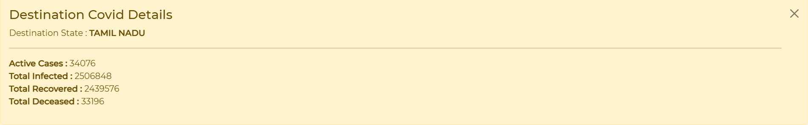
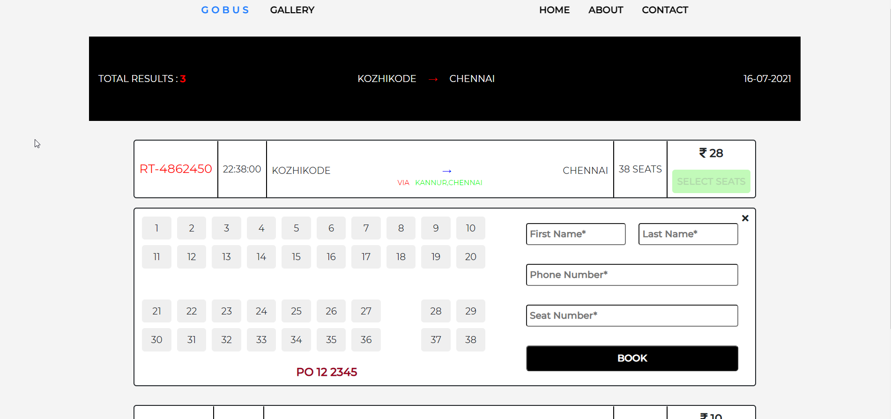
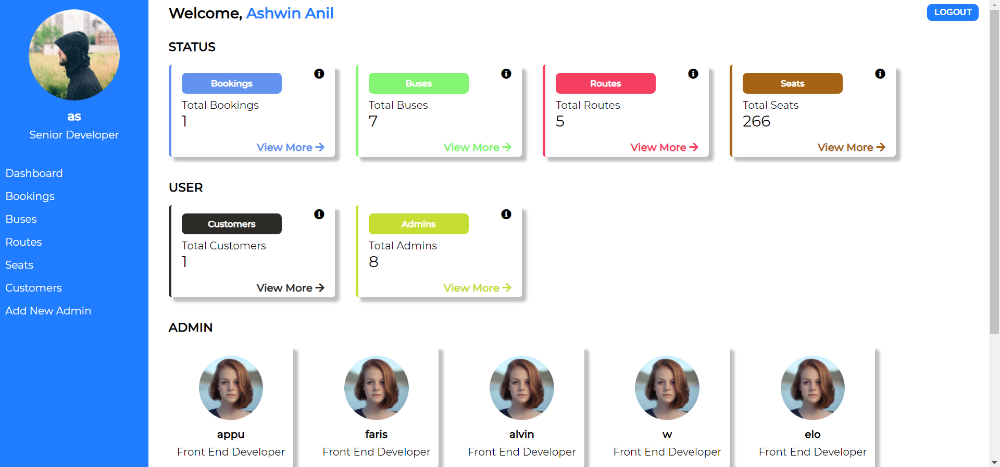
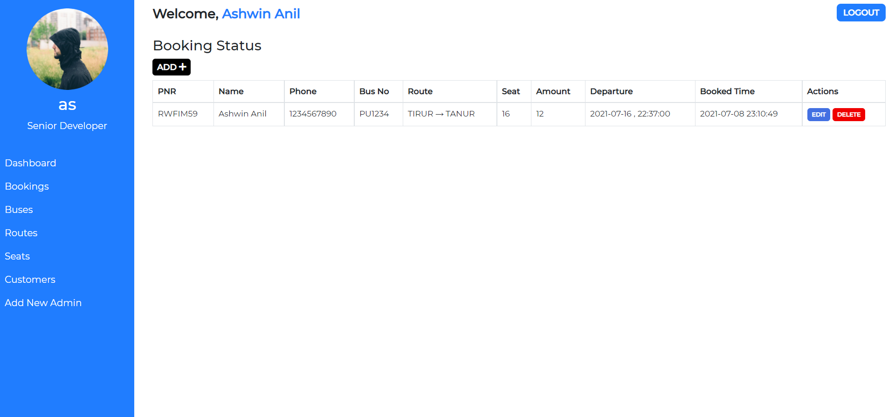
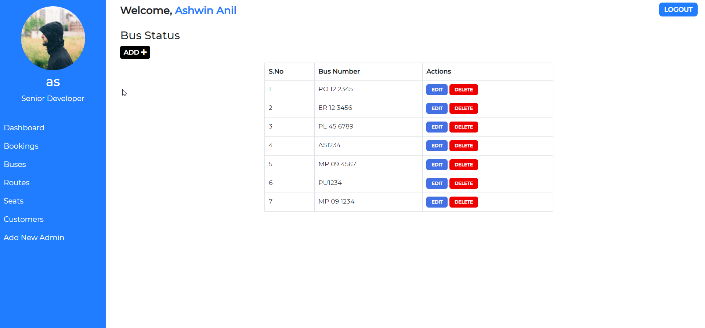
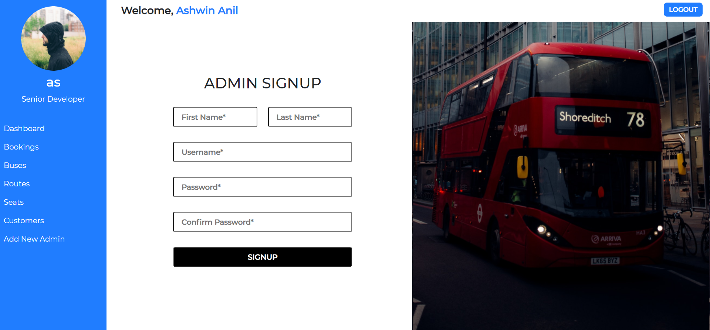
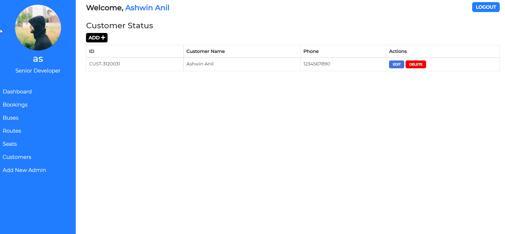
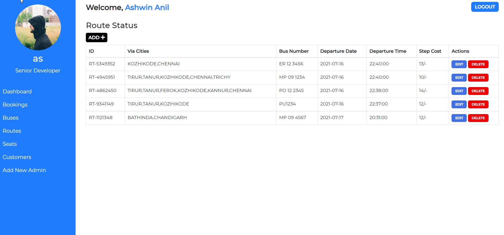

GoBus
---

GoBus is a **bus ticket booking system built using PHP**. This project is aimed to enhance ticket allotment system for buses which are one of the most widely used means of public transport. The details such as buses, bus number, bus routes, booking and customer details will be provided and maintained by using a Database System.

### Requirements
- **Software**
    -  PHP >= 5.0
    - XAMPP

- **Hardware**
    - Intel Pentium IV orocessor or higher
    - 512 MB RAM or higher
    - 20 GB HDD or higher
    - Network Connectivity

### Installation
1. Clone this repo into a desired directory.
2. Open XAMPP, start Apache and MySql. Go to the XAMPP shell and migrate to the project directory and start the php server with this command:

    ```sh
    php -S localhost:8000
    ```
3. Navigate to http://localhost:8000
4. Voila!

### Features

### Login to Admin Dashboard

### Website Screenshots

- #### Index Page


- #### Routes Page
    - **Destination Covid Details** : The destination state COVID details are showed here. 
        > **API endpoint used**- `https://api.apify.com/v2/key-value-stores/toDWvRj1JpTXiM8FF/records/LATEST?disableRedirect=true` 

        

    - **Route Details** : All routes matching the route Search Form values submitted by the user is shown here.
        

- #### Admin Pages
    -  **Dashboard** : Contains the summary of all the other fields of importance i.e Bookings, Buses, Seats, Routes, Customers and Admins.
        

    - **Bookings** : List of all bookings made.
        

    - **Buses** : List of all buses added.
        

    - **Add new Admin** : Here, an existing admin can add more admins. This ensures that no fake accounts are created.
        
    
    - **Customers** : Details about all the customers present in the database is shown here.
        

    - **Routes** : Details about all the routes present in the database is shown here.
        

### To-Do List

- [ ] Host this project
- [ ] Genuine Calculation of Booking Amount.
- [ ] Admin should be able to upload image which can be cropped in the website.
- [ ] Email should be sent to the customer on booking completion.
- [ ] A booking ticket to be sent in the email, which can also be made available through PNR enquiry(Design - 30% done).
- [ ] Displaying the weather in admin pages.(API)
- [ ] Client Side form Validation
- [ ] Code Gallery Page.
- [ ] Contact Form
- [ ] Add Cool CSS Loaders to the Site 

---
**<center>Made with &#10084;&#65039; by Ashwin Anil</center>**


